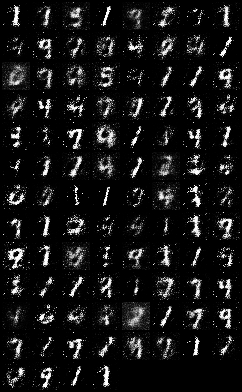

# gan_mnist_digits
In this repository we generate handwritten digits using a VAE and GAN and the MNIST Digits dataset.

## Original digits

## Generated Digits Using a VAE

| Epoch 10 | Epoch 20 | Epoch 30 | Epoch 40 | Epoch 50 |
| :-: | :-: | :-: | :-: | :-: |
|  |  |  |  |  |